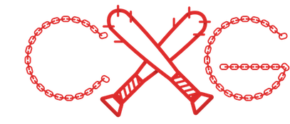

#  Chain Gang &nbsp;  

    

JavaScript library for quick HTML node creation, inheritance, and rendering through method chaining.

__*Key Words*__  
Chain *n.* - an individual Node, or Fragment, and a child of the previous Object.   
Gang *n.* - a collective group of Chains, all inside a container Element or Fragment. No container, no Gang.

__*Note:*__ Chain Gaing uses PascalCase (UpperCamelCase) naming convetions rather than camelCase. This allows for the use of words that are otherwise reserved.

- - -

###Starting a Chain
To make chain, type `Gang()`, which will create a parent container on which you can add chains.
However, Chain Gang doesnt know what type of container you want. You have to clarify. There are 2 types of containers:
- HTML Element Node `Gang().Element(elementType)`
- Document Fragment `Gang().Fragment()`

- - -

###Creating a Chain of Elements
Creating the container element of a Gang is the only place where the method `Element()` is used.
Every other element would be a *Chain* or a *Sibling of a Chain*.
When the Gang is complete, use the `End()` method.
#####Example:
```javascript
Gang().Element("div")
	.Chain("span")
	.End();
```
...would produce...

```html
<div>
	<span></span>
</div>
```

- - -

###Adding Attributes to an Element
Building off of the previous example, just use Chain Gang Methods for adding HTML attributes before you call `.Chain()`, `.Sibling()`, or `.End()`.  All Methods are in Pascal Case, not Camel Case.
#####Example:
```javascript
Gang().Element("div").Id("parent").Class("happy").Data("happyparent",true)
	.Chain("span").Class("baby").Class("boy").Text("It's a Boy!")
	.End();
```
...would produce...

```html
<div id="parent" class="happy" data-happyparent="true">
	<span class="baby boy">It's a Boy!</span>
</div>
```

- - -

###Once a Gang Member, Always a Gang Member
Any element that was created in a Gang will always have access to chaining. A great example is when adding event listeners:
```javascript
// creates div element and adds click listener
Gang().Element("div").Listener("click", doSomething);

...

function doSomething(){
	// adds class to clicked div element (this)
	// adds a child paragraph to clicked element
	// gives child some text
	this.Class("selected").Chain("p").Text("You clicked my parent!");
}
```
  
- - -
  
###Sibling Chaining
The `Sibling()` method adds a new element __*after*__ the element that it is being called on (rather than inside like `Chain()`). It takes one parameter—the new element type.
#####Example:
The second paragraph is a sibling to the first:
```javascript
Gang().Element("div").Id("parent")
	.Chain("p").Id("child1")
	.Sibling("p").Id("child2")
		.Chain("span").Text("I'm inside child 2")
	.End();
```  
...would produce...  

```html
<div id="parent">
	<p id="child1"></p>
	<p id="child1"><span>I'm inside child 2</span></p>
</div>
```
It makes for more legible code to indent everytime you call a `.Chain()` method and to stay at the same level (NOT indent) when calling the `.Sibling()` method.

- - -

###Traversing Up the Chain
How could we add a Sibling to an element if we already added a Chain?    
Produces Unintended Result:
```javascript
Gang().Element("div").Id("parent")
	.Chain("p").Id("child1")
		.Chain("span").Id("child1_span")
	.Sibling("p").Id("child2") // this would add a sibling to the span, not child 1
	.End();
```  
The solution is the `.Up()` method. It traverses "up" the chain by one node.  

*Note:* Where we indent when we call the *Chain* method, we would unindent when calling the *Up* method:
```javascript
Gang().Element("div").Id("parent")
	.Chain("p").Id("child1")
		.Chain("span").Id("child1_span")
	.Up()
	.Sibling("p").Id("child2") // this would add a sibling to child 1
	.End();
```

- - -

###Using Document Fragments    

__*Documentation Coming Soon*__

- - -

###Adding Gangs to the Document    

__*Documentation Coming Soon*__

- - -

###List of HTML Attributes and Properties    
The corresponding methods for setting HTML attributes are:    
- id `.Id(value)`
- class (add) `.Class(value)`
- class (remove) `.RemoveClass(value)`
- class (toggle) `.ToggleClass(value)`
- src `.Src(value)`
- href `.Href(value)`
- alt `.Alt(value)`
- data-*key* `.Id(key, value)`
- type `.Type(value)`
- method `.Method(value)`
- action `.Action(value)`
- name `.Name(value)`
- value `.Value(value)`
- checked `.Checked(boolean)`
- value `.Value(value)`
- placeholder `.Placeholder(value)`

To add a textNode to an element:
- `.Text(value)`

- - -

###Feature Roadmap
Future features that are on the list:
- develop chaining for more specialized html elements
- one-way data-binding
- finish this README
- Add more examples to README
- make video tutorials (not related to repo, just to be friendly)
