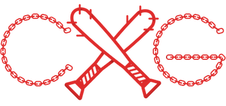

#  Chain Gang &nbsp;    
[](http://badge.fury.io/gh/eaton11%2FChainGang)  
    

**JavaScript library for quick HTML node creation, inheritance, and rendering through method chaining.**

*"JavaScript be doing drive-by's in HTML's turf."*

__*Key Words*__  
__Chain__ *n.* - an individual Node, or Fragment, and a child of the previous Object.   
__Gang__ *n.* - a collective group of Chains, all inside a container Element or Fragment. No container, no Gang.

__*Note:*__ Chain Gang uses PascalCase (UpperCamelCase) naming convetions rather than camelCase. This allows for the use of words that are otherwise reserved.

- - -

###Starting a Chain
To make chain, type `Gang()`, which will create a parent container on which you can add chains. The `Gang` container can serve a few different purposes:  
- The container for a new set of Chains  `Gang().Chain(elementType)`
- Join other Gangs  `Gang([gang1, gang2])`
- Give Gang method features to already existing DOM elements  `Gang("#idName")`

- - -

###Creating a Chain of Elements
Every Element needs to be created with the `Chain` or `Sibling` method. The very first element in the Gang must be created with a `Chain` , because otherwise, there are no elements to add a sibling to.

#####Example:
```javascript
Gang().Chain("div")
	.Chain("span");
```
...would produce...

```html
<div>
  <span></span>
</div>
```

- - -

###Creating Elements with One Id and/or One Class
When you create an element with the `Chain` or `Sibling` methods, you can pass one Id and/or one class.   
#####Example:
```javascript
Gang().Chain("div#container")
	.Chain("p.thug").
		.Chain("span#gangster.hard");
```
...would produce...

```html
<div id="container">
	<p class="thug">
		<span id="gangster" class="hard"></span>
	</p>
</div>
```
__*Note:*__ you can't set more than one class when creating an element, there are other methods below for multiple classes.

- - -

###Adding Attributes to an Element
Building off of the example in the above *Creating a Chain of Elements* section, just use Chain Gang Methods for adding HTML attributes before you call the next element's `.Chain()` or `.Sibling()`.  All Methods are in PascalCase, not camelCase.
#####Example:
```javascript
Gang().Chain("div").Id("parent").Class("happy").Data("happyparent",true)
	.Chain("span").Class(["baby", "boy"]).Text("It's a Boy!");
```
...would produce...

```html
<div id="parent" class="happy" data-happyparent="true">
	<span class="baby boy">It's a Boy!</span>
</div>
```

####The `Attr` Method
The `Attr` Method allows you to combine multiple method calls into a single method. This method serves to cater to differing preferences. These two chains are functionally identical:  
*JavaScript*
```javascript
// chain 1
.Chain("div").Text("Child 2").Class(["cool","tired","hungry"]).Data("super",2})
// chain 2		
.Sibling("div").Attr({
	"Text": "Child 3", 
	"Class":["cool", "tired", "hungry"],
	"Data":{"super":3}
})
```
*HTML*
```html
<div class="cool tired hungry" data-super="1">Child 1</div>
<div class="cool tired hungry" data-super="2">Child 2</div>
```
The properties of the object that you pass to Attr are just the name of the methods you would normally use. Notice how "Text", "Class", and "Data" inside the` Attr` method are all uppercase. Also, in `Attr` , data sets must be set using an object, whereas for the `Data` method it is optional.  

Methods can continue to be chained to `Attr`, you can mix and match.

- - -

###Passing Around Gangs or Chains
With `Chain` or `Sibling`, you can create a new Gang Element, or insert other Chains or Gangs.  Any additional methods you call on a Gang after it is created will just continue where it left off.    
#####Example:
```javascript
var kittens = Gang().Chain("p").Id("kitten_1").Sibling("p").Id("kitten_2");

kittens.Sibling("p").Id("kitten_3");

var CatGang = Gang()
	.Chain("div").Id("CatGang")
		.Chain("p").Id("cat_1")
		.Sibling(kittens).Data("lucky","getsMilk")
		.Sibling("p").Id("cat_2");
		
```
```html
<div id="CatGang">
	<p id="cat_1"></p>
	<p id="kitten_1"></p>
	<p id="kitten_2"></p>
	<p id="kitten_3" data-lucky="getsMilk"></p>
	<p id="cat_2"></p>
</div>
```

####Jumping back to the Main Gang Conainer
At any point during chaining, you can jump back to the top of the current gang by using another `Gang()` call.
In this example, the `cat_loner` would have been inside `kitten_1` without the additional `Gang()`
```javascript
var CatGang = Gang()
	.Chain("div").Id("CatGang")
		.Chain("p").Id("cat_1")
			.Chain("p").Id("kitten_1")
			.Gang()
	.Chain("p").Id("cat_loner").Text("cat_loner");
```
```html
<div id="CatGang">
	<p id="cat_1">
		<p id="kitten_1"></p>
	</p>
</div>
<p id="cat_loner"></p>
```

- - -

###Once a Gang Member, Always a Gang Member
Any element that was created in a Gang will always have access to chaining. A great example is when adding event listeners:
```javascript
// creates div element and adds click listener
Gang().Chain("div").Listener("click", doSomething);

...

function doSomething(){
	// adds class to clicked div element (this)
	// adds a child paragraph to clicked element
	// gives child some text
	this.Class("selected").Chain("p").Text("You 'clicked' my parent, now I'm born!");
}
```
  
- - -
  
###Sibling Chaining
The `Sibling()` method adds a new element __*after*__ the element that it is being called on (rather than inside like `Chain()`). It can take the same parameters as `Chain()`.
#####Example:
The second paragraph is a sibling to the first:
```javascript
Gang().Element("div").Id("parent")
	.Chain("p").Id("child1")
	.Sibling("p").Id("child2")
		.Chain("span").Text("I'm inside child 2")
	.End();
```  
...would produce...  

```html
<div id="parent">
	<p id="child1"></p>
	<p id="child1"><span>I'm inside child 2</span></p>
</div>
```
It makes for more legible code to indent every time you call a `.Chain()` method and to stay at the same level (NOT indent) when calling the `.Sibling()` method.

**Note:** `Sibling()` can __*not*__ be used after a `Gang()`.

- - -

###Traversing Up the Chain
How could we add a Sibling to an element if we already added a Chain?    
Produces Unintended Result:
```javascript
Gang().Element("div").Id("parent")
	.Chain("p").Id("child1")
		.Chain("span").Id("child1_span")
	.Sibling("p").Id("child2") // this would add a sibling to the span, not child 1
	.End();
```  
The solution is the `.Up()` method. It traverses "up" the Gang by one Chain.  

*Note:* Where we indent when we call the *Chain* method, we would unindent when calling the *Up* method:
```javascript
Gang().Element("div").Id("parent")
	.Chain("p").Id("child1")
		.Chain("span").Id("child1_span")
	.Up()
	.Sibling("p").Id("child2") // this would add a sibling to child 1
	.End();
```

- - -

###Adding a Gang To the Document
To add gangs to the dom, we refer to an element in the `Gang` method by its Id. *Example*: `Gang("idName")`   
To add to the element, we simply Chain a Gang in. 
```javascript
var myGang = Gang().Chain("p").Text("I'm a paragraph");
Gang("destination_element_id").Chain(myGang);
```

We can garantee that the element is before adding to it by using the `Purge` method before `Chain`. Purge can be used anytime and will delete all of the elements children.
```javascript
var myGang = Gang().Chain("p").Text("I'm a paragraph");
Gang("destination_element_id").Purge().Chain(myGang);
```

For adding multiple Gangs to the dom at the same time, see the next section.

- - -

###Grouping Gangs

Multiple Gangs can be grouped by by passing an array of Gangs to a new `Gang()` method. This allows us to add multiple Gangs to the DOM in one fell swoop, rather than individually,  which allows for better DOM performance.     
#####Example: 
```html
<!-- HTML before getting Gang banged -->
<div id="AnimalsContainer">
	<div>I will be purged</div>
</div>
```
```javascript
// JavaScript
var DogGang = Gang().Chain("div").Id("DogGang")
	.Chain("p").Id("dog1")
	.Sibling("p").Id("dog2");

var CatGang = Gang().Chain("div").Id("CatGang")
	.Chain("p").Id("cat1")
	.Sibling("p").Id("cat2");

var MouseGang = Gang().Chain("div").Id("MouseGang")
	.Chain("p").Id("mouse1")
	.Sibling("p").Id("mouse2");

var AnimalGangs = Gang([DogGang, CatGang, MouseGang]);

Gang("AnimalsContainer").Purge().Chain(AnimalGangs);
```
```html
<div id="AnimalsContainer">
	<div id="DogGang">
		<p id="dog1"></p>
		<p id="dog2"></p>
	</div>
	<div id="CatGang">
		<p id="cat1"></p>
		<p id="cat2"></p>
	</div>
	<div id="MouseGang">
		<p id="mouse1"></p>
		<p id="mouse2"></p>
	</div>
</div>
```
- - -

###List of HTML Attributes and Properties    
The corresponding methods for setting HTML attributes are:    
- id `.Id(value)`
- class (add) `.Class(value)` or `.Class([value1, value2, etc])`
- class (remove) `.RemoveClass(value)` or `.Class([value1, value2, etc])`
- class (toggle) `.ToggleClass(value)` or `.Class([value1, value2, etc])`
- src `.Src(value)`
- href `.Href(value)`
- alt `.Alt(value)`
- data-*key* `.Data( key: value )` , `.Data({key: value})` , `.Data({key1: value1, key2: value2})`    
&nbsp;&nbsp;&nbsp;&nbsp;The ability to pass an object as a parameter for `Data()` is necessary for setting Data attribute(s) in the `Attr` method
- type `.Type(value)`
- method `.Method(value)`
- action `.Action(value)`
- name `.Name(value)`
- value `.Value(value)`
- checked `.Checked(boolean)`
- value `.Value(value)`
- placeholder `.Placeholder(value)`

To add a textNode to an element:
- `.Text(value)`


Other Methods:
- `Chain()` 
- `Sibling()`
- `Up()` - Traverses up the Gang by one chain
- `Purge()` - Removes all children from Element
- `Gang()` - Traverses to top of current gang

- - -

###Feature Roadmap
Future features that are on the list:
- develop chaining for more specialized html elements
- one-way data-binding?
- make video tutorials (not related to repo, just to be friendly)